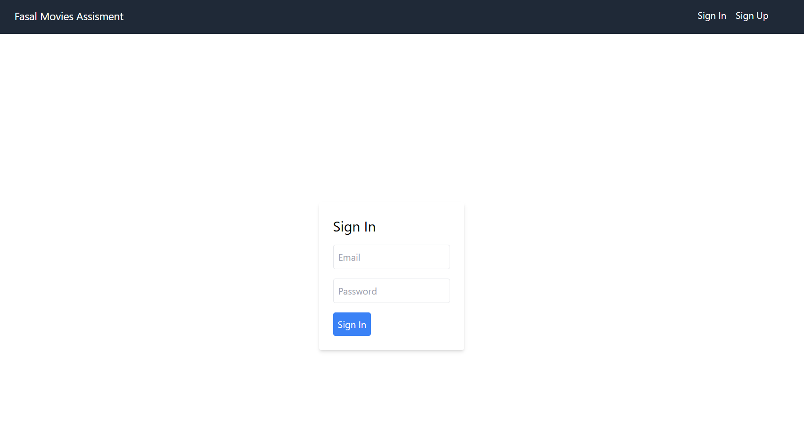

# Movie List Application

This is a full-stack application for managing movie lists. Users can sign up, log in, create movie lists, and add movies to those lists. The frontend is built with React, TypeScript, and Tailwind CSS, while the backend uses Node.js, Express.js, and MongoDB.

## Features

- User Authentication
- Search for Movies using the OMDb API
- Create, Edit, and Delete Movie Lists
- Add and Remove Movies from Lists
- Set List Visibility (Public/Private)
- Share Public Lists

## Prerequisites

- Node.js
- MongoDB (Local or Cloud instance like MongoDB Atlas)
- OMDb API Key

## Setup

## Frontend
### Navigate to the frontend directory:

```sh

cd ../frontend
Install dependencies:
```
```sh

npm install

```
Create a .env file in the frontend directory and add

```sh
REACT_APP_BACKEND_URL=http://localhost:5000
REACT_APP_OMDB_API_KEY=your_omdb_api_key
```
Start the frontend development server:

```sh

npm start
```
### Backend

1. Clone the repository:

   ```sh
   git clone https://github.com/ProgrammingPirates/Fasal_Assessment.git
   cd /backend
### Install dependencies:
```sh
npm install
```
Create a .env file in the backend 
```sh
PORT=5000
MONGO_URI=your_mongo_uri
JWT_SECRET=your_jwt_secret





